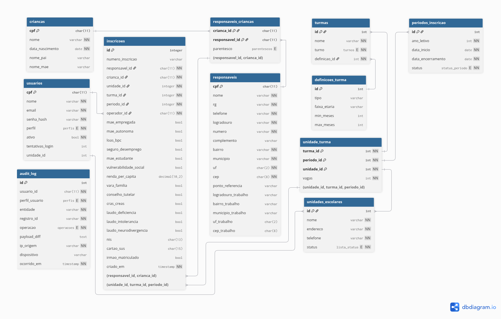

# Modelagem de Dados — Sistema de Inscrição em Creche

Este documento apresenta a modelagem de dados do **Sistema de Inscrição para Creche da Rede Municipal**, estruturada com base nos requisitos definidos no PRD (Product Requirements Document).

A modelagem foi concebida com foco em:

- **integridade e consistência dos dados**, garantindo que as regras de negócio sejam respeitadas no nível do banco de dados;
- **rastreabilidade completa das operações**, por meio de mecanismos de auditoria alinhados às exigências administrativas e à LGPD;
- **clareza estrutural**, separando conceitos como cadastro, oferta de vagas e registro de inscrições;
- **segurança e controle de acesso**, com suporte a perfis distintos e restrições bem definidas;
- **manutenibilidade e evolução**, permitindo adaptações futuras sem comprometer a base de dados.

O modelo adota uma abordagem relacional normalizada, utilizando chaves primárias bem definidas, relacionamentos explícitos e constraints para reforçar regras críticas do domínio, como unicidade de inscrição por criança em cada ano letivo e vinculação obrigatória entre entidades.

---

## Organização do Documento

A modelagem está apresentada nas seguintes seções:

### 1. Diagrama Entidade-Relacionamento (DER)

Representação visual da estrutura do banco de dados, evidenciando entidades, atributos e relacionamentos. Esta visão facilita a compreensão global do sistema e suas interdependências.



---

### 2. Script DBML

Definição da modelagem em **DBML (Database Markup Language)**, utilizada para documentação e visualização em ferramentas como dbdiagram.io. Este formato serve como base conceitual e intermediária da modelagem.

``` dbml
// Use DBML to define your database structure
// Docs: https://dbml.dbdiagram.io/docs

Enum status_periodo {
  aberto [note: "Permite novas inscrições"]
  encerrado [note: "Bloqueia novas inscrições e edição"]
}

Table periodos_inscricao {
  id int [primary key]
  ano_letivo int [not null]
  data_inicio date [not null]
  data_encerramento date [not null]
  status status_periodo [not null]
}

Table criancas {
  cpf char(11) [primary key]
  nome varchar [not null]
  data_nascimento date [not null]
  nome_pai varchar
  nome_mae varchar
}

Table responsaveis {
  cpf char(11) [primary key]
  nome varchar [not null]
  rg varchar [not null]
  telefone varchar [not null]

  logradouro varchar [not null]
  numero varchar [not null]
  complemento varchar
  bairro varchar [not null]
  municipio varchar [not null]
  uf char(2) [not null]
  cep char(8) [not null]
  ponto_referencia varchar
  
  logradouro_trabalho varchar
  bairro_trabalho varchar
  municipio_trabalho varchar
  uf_trabalho char(2)
  cep_trabalho char(8)  
}

Enum parentescos {
  mae
  pai
  responsavel_legal
  familiar
  cuidador
}

Table responsaveis_criancas{
  crianca_id char(11)
  responsavel_id char(11)  
  parentesco parentescos
  indexes {
    (responsavel_id, crianca_id) [pk]
  }
}

Ref: responsaveis_criancas.crianca_id > criancas.cpf
Ref: responsaveis_criancas.responsavel_id > responsaveis.cpf


Table inscricoes {
  id integer [primary key]
  numero_inscricao varchar [unique, note: "Formato: AAAA + sequência (ex: 202600001)"]
  responsavel_id char(11) [not null]
  crianca_id char(11) [not null]
  unidade_id integer [not null]
  turma_id integer [not null]
  periodo_id integer [not null]
  indexes {
    (crianca_id, periodo_id) [unique, name: "uk_inscricao_unica_por_periodo"]
  }
  operador_id char(11) [not null]
  // situação socioeconômica
  mae_empregada bool [default: false]
  mae_autonoma bool [default: false]
  loas_bpc bool [default: false]
  seguro_desemprego bool [default: false]
  mae_estudante bool [default: false]
  vulnerabilidade_social bool [default: false]
  renda_per_capita decimal(10,2) [note: "Valor informado pelo responsável"]
  // encaminhamentos / saúde
  vara_familia bool [default: false]
  conselho_tutelar bool [default: false]
  cras_creas bool [default: false]
  laudo_deficiencia bool [default: false]
  laudo_intolerancia bool [default: false]
  laudo_neurodivergencia bool [default: false]
  nis char(13)
  cartao_sus char(15)
  irmao_matriculado bool [default: false]
  criado_em timestamp [not null, note: "Timestamp da criação da inscrição. \nSerá preenchido automaticamente pelo banco via DEFAULT NOW() e não pela aplicação, para evitar manipulação."]
}


Ref: inscricoes.(responsavel_id, crianca_id) > responsaveis_criancas.(responsavel_id, crianca_id)
ref: usuarios.cpf < inscricoes.operador_id

Enum lista_status {
  ativa
  inativa
}

Table unidades_escolares {
  id int [primary key]
  nome varchar [not null, unique]
  endereco varchar [not null]
  telefone varchar [not null]
  status lista_status [not null]  
}

Table definicoes_turma {
  id int [primary key]
  tipo varchar
  faixa_etaria varchar
  min_meses int [note: "Idade mínima em meses na data de corte"]
  max_meses int [note: "Idade máxima em meses na data de corte"]
}

Records definicoes_turma(id, tipo, faixa_etaria, min_meses, max_meses){
  1, 'Berçário I', '6 meses a 1 ano, 11 meses e 29 dias de idade', 0,11
  2, 'Berçário II', '2 anos a 2 anos, 11 meses e 29 dias de idade', 12,23
  3, 'Berçário III', '3 anos a 3 anos, 11 meses e 29 dias de idade', 24,35
  4, '1º Período', '4 anos a 4 anos, 11 meses e 29 dias de idade', 36,47
  5, '2º Período', '5 anos a 5 anos, 11 meses e 29 dias de idade', 48,59
}


Enum turnos {
  "manha"
  "tarde"
  "integral"
}

Table turmas {
  id int [primary key]
  nome varchar [not null]
  turno turnos [not null]
  definicao_id int [not null]  
}

ref: definicoes_turma.id < turmas.definicao_id

Enum perfis {
  administrador
  secretario_educacao
  diretor
  secretario_escolar
}

Table usuarios {
  cpf char(11) [primary key]
  nome varchar [not null]
  email varchar [not null, unique]
  senha_hash varchar [not null, note: "Hash seguro (bcrypt/argon2)"]
  perfil perfis [not null]
  ativo bool [not null]
  tentativas_login int [default: 0, note: "Controle de bloqueio"]
  unidade_id int [note: "Obrigatório para Diretor/Secretário Escolar"]
}

Table unidade_turma {
  
  turma_id int [not null]
  periodo_id int [not null, 
    note: "FOREIGN KEY (unidade_id, turma_id, periodo_id) REFERENCES unidade_turma (unidade_id, turma_id, periodo_id)"
  ]
  unidade_id int [not null]
  vagas int [not null]

  indexes {
    (unidade_id, turma_id, periodo_id) [pk]
  }
}

ref: unidades_escolares.id > usuarios.unidade_id
ref: unidades_escolares.id > unidade_turma.unidade_id
ref: periodos_inscricao.id > unidade_turma.periodo_id
ref: turmas.id > unidade_turma.turma_id
Ref: inscricoes.(unidade_id, turma_id, periodo_id) > unidade_turma.(unidade_id, turma_id, periodo_id)


Enum operacoes{
  C
  R
  U
}

Table audit_log {
  id int [primary key]
  usuario_id char(11) [not null]
  perfil_usuario perfis [not null]
  entidade varchar [not null]
  registro_id varchar [not null]
  operacao operacoes [not null]
  payload_diff text [note: "JSON com alterações (campo, valor anterior, valor novo)"]
  ip_origem varchar [not null]
  dispositivo varchar [note: "User agent ou identificador do dispositivo"]
  ocorrido_em timestamp [not null]
}

```
---

### 3. Script DDL (PostgreSQL)

Implementação completa do banco de dados em **SQL (PostgreSQL 14+)**, incluindo:

- criação de tabelas
- definição de tipos enumerados
- constraints de integridade
- chaves primárias e estrangeiras
- índices
- estrutura de auditoria

Este script representa a versão executável da modelagem, pronta para implantação em ambiente de produção.

```SQL
-- =============================================================================
-- DDL — Sistema de Inscrição em Creche da Rede Municipal
-- Banco de dados: PostgreSQL 14+
-- Versão do modelo: DBML v3 (revisão final)
-- Nota: campos de timestamp declarados como TIMESTAMPTZ (limitação do dbdiagram.io
--       contornada aqui conforme nota de implementação acordada)
-- =============================================================================


-- -----------------------------------------------------------------------------
-- EXTENSÕES
-- -----------------------------------------------------------------------------

CREATE EXTENSION IF NOT EXISTS "pgcrypto";  -- para gen_random_uuid() se necessário


-- -----------------------------------------------------------------------------
-- TIPOS ENUMERADOS
-- -----------------------------------------------------------------------------

CREATE TYPE status_periodo   AS ENUM ('aberto', 'encerrado');
CREATE TYPE lista_status      AS ENUM ('ativa', 'inativa');
CREATE TYPE parentescos       AS ENUM ('mae', 'pai', 'responsavel_legal', 'familiar', 'cuidador');
CREATE TYPE turnos             AS ENUM ('manha', 'tarde', 'integral');
CREATE TYPE perfis             AS ENUM ('administrador', 'secretario_educacao', 'diretor', 'secretario_escolar');
CREATE TYPE operacoes          AS ENUM ('C', 'R', 'U');


-- -----------------------------------------------------------------------------
-- TABELA: periodos_inscricao
-- Gerenciada pelo Administrador. Define o janela anual de inscrições.
-- Regra: apenas um período por ano_letivo (constraint unique).
-- -----------------------------------------------------------------------------

CREATE TABLE periodos_inscricao (
    id               SERIAL          PRIMARY KEY,
    ano_letivo       SMALLINT        NOT NULL,
    data_inicio      DATE            NOT NULL,
    data_encerramento DATE           NOT NULL,
    status           status_periodo  NOT NULL DEFAULT 'aberto',

    CONSTRAINT uk_periodo_ano_letivo  UNIQUE (ano_letivo),
    CONSTRAINT ck_periodo_datas       CHECK  (data_encerramento > data_inicio)
);

COMMENT ON TABLE  periodos_inscricao               IS 'Períodos oficiais de inscrição, um por ano letivo.';
COMMENT ON COLUMN periodos_inscricao.status        IS 'aberto: permite inscrições; encerrado: bloqueia novas inscrições e edição.';
COMMENT ON COLUMN periodos_inscricao.ano_letivo    IS 'Ano letivo de referência. Único por período.';


-- -----------------------------------------------------------------------------
-- TABELA: unidades_escolares
-- Cadastradas pelo Secretário de Educação.
-- -----------------------------------------------------------------------------

CREATE TABLE unidades_escolares (
    id        SERIAL       PRIMARY KEY,
    nome      VARCHAR(200) NOT NULL,
    endereco  VARCHAR(300) NOT NULL,
    telefone  VARCHAR(20)  NOT NULL,
    status    lista_status NOT NULL DEFAULT 'ativa',

    CONSTRAINT uk_unidade_nome UNIQUE (nome)
);

COMMENT ON TABLE unidades_escolares IS 'Unidades escolares da rede municipal de educação.';


-- -----------------------------------------------------------------------------
-- TABELA: usuarios
-- Gerenciados pelo Administrador (Secretário de Educação) e
-- pelo Secretário de Educação (Diretores e Secretários Escolares).
-- unidade_id é obrigatório para perfis diretor e secretario_escolar.
-- -----------------------------------------------------------------------------

CREATE TABLE usuarios (
    cpf               CHAR(11)     PRIMARY KEY,
    nome              VARCHAR(200) NOT NULL,
    email             VARCHAR(200) NOT NULL,
    senha_hash        VARCHAR(255) NOT NULL,
    perfil            perfis       NOT NULL,
    ativo             BOOLEAN      NOT NULL DEFAULT TRUE,
    tentativas_login  SMALLINT     NOT NULL DEFAULT 0,
    unidade_id        INTEGER      REFERENCES unidades_escolares (id) ON DELETE RESTRICT,

    CONSTRAINT uk_usuario_email UNIQUE (email),
    CONSTRAINT ck_usuario_cpf   CHECK  (cpf ~ '^\d{11}$'),
    CONSTRAINT ck_unidade_perfil CHECK (
        (perfil IN ('diretor', 'secretario_escolar') AND unidade_id IS NOT NULL)
        OR perfil NOT IN ('diretor', 'secretario_escolar')
    )
);

COMMENT ON TABLE  usuarios                   IS 'Usuários do sistema com controle de acesso por perfil (RBAC).';
COMMENT ON COLUMN usuarios.cpf               IS 'CPF sem formatação (11 dígitos). Chave primária.';
COMMENT ON COLUMN usuarios.senha_hash        IS 'Hash seguro gerado com bcrypt ou argon2. Nunca armazenar senha em texto plano.';
COMMENT ON COLUMN usuarios.tentativas_login  IS 'Contador de tentativas inválidas consecutivas. Zerado após login bem-sucedido.';
COMMENT ON COLUMN usuarios.unidade_id        IS 'Obrigatório para perfis diretor e secretario_escolar. Nulo para administrador e secretario_educacao.';


-- -----------------------------------------------------------------------------
-- TABELA: definicoes_turma
-- Tabela de referência com as faixas etárias padrão da rede.
-- Populada com seed fixo. Raramente alterada.
-- -----------------------------------------------------------------------------

CREATE TABLE definicoes_turma (
    id           SERIAL       PRIMARY KEY,
    tipo         VARCHAR(50)  NOT NULL,
    faixa_etaria VARCHAR(100),
    min_meses    SMALLINT     NOT NULL,
    max_meses    SMALLINT     NOT NULL,

    CONSTRAINT ck_faixa_etaria CHECK (max_meses > min_meses)
);

COMMENT ON TABLE  definicoes_turma             IS 'Definições padrão de tipos de turma com faixas etárias em meses (corte: 31/03 do ano letivo).';
COMMENT ON COLUMN definicoes_turma.min_meses   IS 'Idade mínima em meses completos na data de corte (31/03).';
COMMENT ON COLUMN definicoes_turma.max_meses   IS 'Idade máxima em meses completos na data de corte (31/03).';

-- Seed
INSERT INTO definicoes_turma (id, tipo, faixa_etaria, min_meses, max_meses) VALUES
    (1, 'Berçário I',   '0 a 11 meses',                                      0,  11),
    (2, 'Berçário II',  '2 anos a 2 anos, 11 meses e 29 dias de idade',      12,  23),
    (3, 'Berçário III', '3 anos a 3 anos, 11 meses e 29 dias de idade',      24,  35),
    (4, '1º Período',   '4 anos a 4 anos, 11 meses e 29 dias de idade',      36,  47),
    (5, '2º Período',   '5 anos a 5 anos, 11 meses e 29 dias de idade',      48,  59);


-- -----------------------------------------------------------------------------
-- TABELA: turmas
-- Cadastradas pelo Diretor ou Secretário Escolar por unidade.
-- A turma em abstrato — vagas ficam em unidade_turma.
-- -----------------------------------------------------------------------------

CREATE TABLE turmas (
    id            SERIAL      PRIMARY KEY,
    nome          VARCHAR(100) NOT NULL,
    turno         turnos       NOT NULL,
    definicao_id  INTEGER      NOT NULL REFERENCES definicoes_turma (id) ON DELETE RESTRICT
);

COMMENT ON TABLE turmas IS 'Turmas cadastradas. Vínculo com unidade e vagas ocorre em unidade_turma.';


-- -----------------------------------------------------------------------------
-- TABELA: unidade_turma
-- Oferta de uma turma em uma unidade para um período letivo específico.
-- PK composta (unidade_id, turma_id, periodo_id).
-- Vagas são definidas aqui, pois variam por unidade e por ano.
-- -----------------------------------------------------------------------------

CREATE TABLE unidade_turma (
    unidade_id  INTEGER  NOT NULL REFERENCES unidades_escolares (id) ON DELETE RESTRICT,
    turma_id    INTEGER  NOT NULL REFERENCES turmas              (id) ON DELETE RESTRICT,
    periodo_id  INTEGER  NOT NULL REFERENCES periodos_inscricao  (id) ON DELETE RESTRICT,
    vagas       SMALLINT NOT NULL,

    CONSTRAINT pk_unidade_turma    PRIMARY KEY (unidade_id, turma_id, periodo_id),
    CONSTRAINT ck_vagas_positivas  CHECK (vagas > 0)
);

COMMENT ON TABLE  unidade_turma            IS 'Oferta de turma por unidade e período. Vagas definidas aqui.';
COMMENT ON COLUMN unidade_turma.vagas      IS 'Número de vagas disponíveis para esta turma nesta unidade neste período.';


-- -----------------------------------------------------------------------------
-- TABELA: responsaveis
-- Dados cadastrais do responsável. CPF é a PK.
-- parentesco migrou para responsaveis_criancas.
-- -----------------------------------------------------------------------------

CREATE TABLE responsaveis (
    cpf                  CHAR(11)     PRIMARY KEY,
    nome                 VARCHAR(200) NOT NULL,
    rg                   VARCHAR(30)  NOT NULL,
    telefone             VARCHAR(20)  NOT NULL,

    -- endereço residencial
    logradouro           VARCHAR(200) NOT NULL,
    numero               VARCHAR(20)  NOT NULL,
    complemento          VARCHAR(100),
    bairro               VARCHAR(100) NOT NULL,
    municipio            VARCHAR(100) NOT NULL,
    uf                   CHAR(2)      NOT NULL,
    cep                  CHAR(8)      NOT NULL,
    ponto_referencia     VARCHAR(200),

    -- endereço do trabalho (opcional)
    logradouro_trabalho  VARCHAR(200),
    bairro_trabalho      VARCHAR(100),
    municipio_trabalho   VARCHAR(100),
    uf_trabalho          CHAR(2),
    cep_trabalho         CHAR(8),

    CONSTRAINT ck_responsavel_cpf  CHECK (cpf ~ '^\d{11}$'),
    CONSTRAINT ck_responsavel_cep  CHECK (cep ~ '^\d{8}$'),
    CONSTRAINT ck_trabalho_cep     CHECK (cep_trabalho IS NULL OR cep_trabalho ~ '^\d{8}$')
);

COMMENT ON TABLE  responsaveis                    IS 'Dados cadastrais do responsável pela inscrição.';
COMMENT ON COLUMN responsaveis.cpf                IS 'CPF sem formatação. Chave primária.';
COMMENT ON COLUMN responsaveis.ponto_referencia   IS 'Referência de localização do endereço residencial.';
COMMENT ON COLUMN responsaveis.logradouro_trabalho IS 'Endereço do trabalho — opcional, coletado para critérios socioeconômicos.';


-- -----------------------------------------------------------------------------
-- TABELA: criancas
-- Dados da criança. CPF é a PK e identificador único de inscrição.
-- -----------------------------------------------------------------------------

CREATE TABLE criancas (
    cpf              CHAR(11)     PRIMARY KEY,
    nome             VARCHAR(200) NOT NULL,
    data_nascimento  DATE         NOT NULL,
    nome_pai         VARCHAR(200),
    nome_mae         VARCHAR(200),

    CONSTRAINT ck_crianca_cpf CHECK (cpf ~ '^\d{11}$')
);

COMMENT ON TABLE  criancas                  IS 'Dados cadastrais da criança. CPF é o identificador único no sistema.';
COMMENT ON COLUMN criancas.cpf              IS 'CPF sem formatação. Obrigatório — toda criança nascida no Brasil recebe CPF na certidão.';
COMMENT ON COLUMN criancas.data_nascimento  IS 'Usada para calcular a idade na data de corte (31/03 do ano letivo).';


-- -----------------------------------------------------------------------------
-- TABELA: responsaveis_criancas
-- Tabela intermediária N:N entre responsaveis e criancas.
-- PK composta (responsavel_id, crianca_id).
-- parentesco é atributo do vínculo, não do responsável.
-- -----------------------------------------------------------------------------

CREATE TABLE responsaveis_criancas (
    responsavel_id  CHAR(11)     NOT NULL REFERENCES responsaveis (cpf) ON DELETE RESTRICT,
    crianca_id      CHAR(11)     NOT NULL REFERENCES criancas      (cpf) ON DELETE RESTRICT,
    parentesco      parentescos  NOT NULL,

    CONSTRAINT pk_responsavel_crianca PRIMARY KEY (responsavel_id, crianca_id)
);

COMMENT ON TABLE  responsaveis_criancas             IS 'Vínculo entre responsável e criança com tipo de parentesco.';
COMMENT ON COLUMN responsaveis_criancas.parentesco  IS 'Tipo de vínculo do responsável com a criança.';


-- -----------------------------------------------------------------------------
-- TABELA: inscricoes
-- Entidade central do sistema. Pré-matrícula de uma criança.
-- FK composta (responsavel_id, crianca_id) → responsaveis_criancas.
-- FK composta (unidade_id, turma_id, periodo_id) → unidade_turma.
-- Regra: uma inscrição por criança por período (uk_inscricao_unica_por_periodo).
-- -----------------------------------------------------------------------------

CREATE TABLE inscricoes (
    id                INTEGER      PRIMARY KEY GENERATED ALWAYS AS IDENTITY,
    numero_inscricao  VARCHAR(20)  NOT NULL,

    -- vínculos principais
    responsavel_id    CHAR(11)     NOT NULL,
    crianca_id        CHAR(11)     NOT NULL,
    unidade_id        INTEGER      NOT NULL,
    turma_id          INTEGER      NOT NULL,
    periodo_id        INTEGER      NOT NULL,
    operador_id       CHAR(11)     NOT NULL REFERENCES usuarios (cpf) ON DELETE RESTRICT,

    -- situação socioeconômica
    mae_empregada         BOOLEAN      NOT NULL DEFAULT FALSE,
    mae_autonoma          BOOLEAN      NOT NULL DEFAULT FALSE,
    loas_bpc              BOOLEAN      NOT NULL DEFAULT FALSE,
    seguro_desemprego     BOOLEAN      NOT NULL DEFAULT FALSE,
    mae_estudante         BOOLEAN      NOT NULL DEFAULT FALSE,
    vulnerabilidade_social BOOLEAN     NOT NULL DEFAULT FALSE,
    renda_per_capita      DECIMAL(10,2),

    -- encaminhamentos institucionais e saúde
    vara_familia          BOOLEAN      NOT NULL DEFAULT FALSE,
    conselho_tutelar      BOOLEAN      NOT NULL DEFAULT FALSE,
    cras_creas            BOOLEAN      NOT NULL DEFAULT FALSE,
    laudo_deficiencia     BOOLEAN      NOT NULL DEFAULT FALSE,
    laudo_intolerancia    BOOLEAN      NOT NULL DEFAULT FALSE,
    laudo_neurodivergencia BOOLEAN     NOT NULL DEFAULT FALSE,
    nis                   CHAR(13),
    cartao_sus            CHAR(15),
    irmao_matriculado     BOOLEAN      NOT NULL DEFAULT FALSE,

    -- auditoria
    criado_em             TIMESTAMPTZ  NOT NULL DEFAULT NOW(),

    -- constraints
    CONSTRAINT uk_numero_inscricao
        UNIQUE (numero_inscricao),

    CONSTRAINT uk_inscricao_unica_por_periodo
        UNIQUE (crianca_id, periodo_id),

    CONSTRAINT fk_inscricao_responsavel_crianca
        FOREIGN KEY (responsavel_id, crianca_id)
        REFERENCES responsaveis_criancas (responsavel_id, crianca_id)
        ON DELETE RESTRICT,

    CONSTRAINT fk_inscricao_unidade_turma
        FOREIGN KEY (unidade_id, turma_id, periodo_id)
        REFERENCES unidade_turma (unidade_id, turma_id, periodo_id)
        ON DELETE RESTRICT
);

COMMENT ON TABLE  inscricoes                         IS 'Pré-matrículas. Entidade central do sistema. Imutáveis após encerramento do período.';
COMMENT ON COLUMN inscricoes.numero_inscricao        IS 'Formato: AAAA + sequência com zeros à esquerda (ex: 202600001). Gerado pela aplicação.';
COMMENT ON COLUMN inscricoes.criado_em               IS 'Preenchido automaticamente pelo banco via DEFAULT NOW(). Não deve ser definido pela aplicação.';
COMMENT ON COLUMN inscricoes.renda_per_capita        IS 'Valor declarado pelo responsável. Campo opcional.';


-- -----------------------------------------------------------------------------
-- TABELA: audit_log
-- Registro imutável de todas as operações do sistema.
-- usuario_id sem FK para preservar log mesmo após desativação de usuário.
-- ocorrido_em como TIMESTAMPTZ para rastreabilidade com fuso horário.
-- -----------------------------------------------------------------------------

CREATE TABLE audit_log (
    id             INTEGER      PRIMARY KEY GENERATED ALWAYS AS IDENTITY,
    usuario_id     CHAR(11)     NOT NULL,
    perfil_usuario perfis       NOT NULL,
    entidade       VARCHAR(100) NOT NULL,
    registro_id    VARCHAR(100) NOT NULL,
    operacao       operacoes    NOT NULL,
    payload_diff   JSONB,
    ip_origem      VARCHAR(45)  NOT NULL,
    dispositivo    VARCHAR(500),
    ocorrido_em    TIMESTAMPTZ  NOT NULL DEFAULT NOW()
);

COMMENT ON TABLE  audit_log               IS 'Log imutável de auditoria. Cobre operações C/R/U em todas as entidades.';
COMMENT ON COLUMN audit_log.usuario_id    IS 'CPF do usuário. Sem FK intencional — log deve sobreviver à desativação do usuário.';
COMMENT ON COLUMN audit_log.registro_id   IS 'Identificador do registro afetado. VARCHAR para suportar PKs int e char(11).';
COMMENT ON COLUMN audit_log.payload_diff  IS 'JSONB com campo, valor_anterior e valor_novo para operações U.';
COMMENT ON COLUMN audit_log.ip_origem     IS 'IPv4 ou IPv6 (até 45 chars para IPv6 completo).';
COMMENT ON COLUMN audit_log.ocorrido_em  IS 'TIMESTAMPTZ — armazenado em UTC, exibido conforme fuso da sessão.';


-- -----------------------------------------------------------------------------
-- ÍNDICES ADICIONAIS
-- -----------------------------------------------------------------------------

-- Consultas frequentes por CPF da criança
CREATE INDEX idx_inscricoes_crianca_id   ON inscricoes (crianca_id);
CREATE INDEX idx_inscricoes_periodo_id   ON inscricoes (periodo_id);
CREATE INDEX idx_inscricoes_unidade_id   ON inscricoes (unidade_id);
CREATE INDEX idx_inscricoes_operador_id  ON inscricoes (operador_id);

-- Auditoria: consultas por usuário e por período
CREATE INDEX idx_audit_usuario_id    ON audit_log (usuario_id);
CREATE INDEX idx_audit_ocorrido_em   ON audit_log (ocorrido_em DESC);
CREATE INDEX idx_audit_entidade      ON audit_log (entidade, registro_id);

-- Consultas de usuários por unidade
CREATE INDEX idx_usuarios_unidade_id ON usuarios (unidade_id);
CREATE INDEX idx_usuarios_perfil     ON usuarios (perfil);


-- -----------------------------------------------------------------------------
-- PROTEÇÃO DO AUDIT LOG
-- Impede UPDATE e DELETE na tabela de auditoria por qualquer usuário,
-- inclusive superusuários de aplicação.
-- -----------------------------------------------------------------------------

CREATE OR REPLACE RULE audit_log_no_update AS
    ON UPDATE TO audit_log DO INSTEAD NOTHING;

CREATE OR REPLACE RULE audit_log_no_delete AS
    ON DELETE TO audit_log DO INSTEAD NOTHING;


-- -----------------------------------------------------------------------------
-- FIM DO DDL
-- =============================================================================

```

---

## Considerações Gerais

A modelagem foi construída respeitando decisões explícitas de escopo do sistema, especialmente:

- o sistema registra **pré-matrículas**, não sendo responsável por critérios de priorização ou alocação de vagas;
- nenhuma inscrição pode ser excluída, garantindo histórico completo;
- todas as operações relevantes são registradas para fins de auditoria;
- o controle de acesso é segmentado por perfil e unidade escolar.

Dessa forma, a base de dados atua como **fundamento confiável para a operação do sistema**, sustentando tanto o uso operacional nas unidades escolares quanto a análise administrativa pela Secretaria de Educação.
