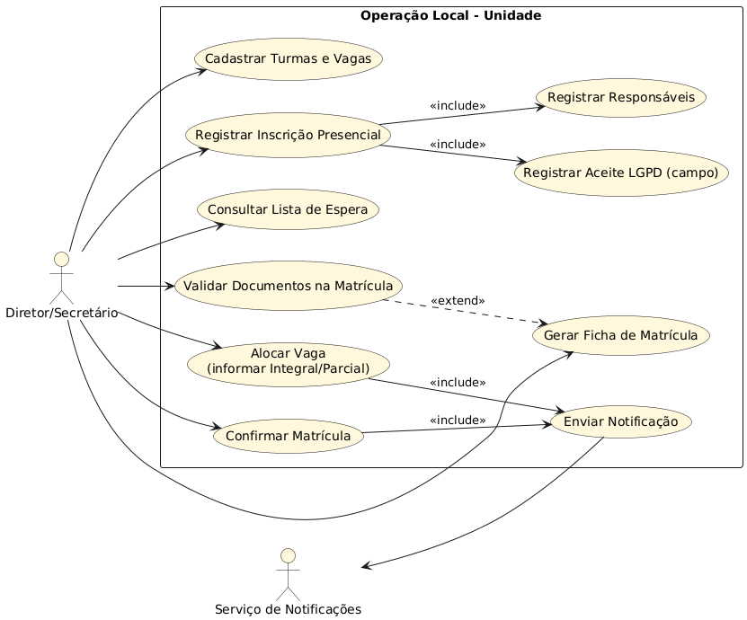

# Casos de Uso
## 1) Atores

* **Administrador do Sistema (TI)**: manutenção técnica, gestão de usuários e parâmetros globais.
* **Secretaria Municipal de Educação (SME)**: gestão normativa e operacional central (ciclos, critérios, calendário, instituições).
* **Diretor/Secretário da Instituição**: operação local (inscrição presencial, turmas/vagas, alocação, matrícula).
* **Serviço de Notificações** (sistema externo): e-mail/SMS/WhatsApp (quando habilitado).

---

## 2) Diagrama UML de Casos de Uso (Visão Geral)

---

## 3) Catálogo de Casos de Uso (Descrições Expandidas)

### UC-01 — Criar Ciclo Letivo

* **Atores**: SME
* **Objetivo**: Iniciar um novo ciclo anual com regras e períodos próprios.
* **Pré-condições**: Não existir outro ciclo “ativo” para o mesmo ano letivo.
* **Pós-condições**: Ciclo criado em estado “Em configuração”.
* **Fluxo principal**:

  1. SME acessa “Ciclos Letivos”.
  2. Informa ano letivo, descrição e parâmetros iniciais.
  3. Sistema valida duplicidade e grava.
* **Alternativos**:

  * A1: Já existe ciclo ativo → sistema bloqueia e informa.

---

### UC-02 — Configurar Calendário do Ciclo

* **Atores**: SME
* **Objetivo**: Definir datas de inscrição, compatibilização, matrícula e prazos.
* **Pré-condições**: Ciclo criado.
* **Pós-condições**: Calendário registrado.
* **Fluxo principal**:

  1. SME seleciona ciclo.
  2. Define início/fim de inscrições, prazos de matrícula e janelas operacionais.
  3. Sistema grava e versiona alteração.
* **Alternativos**:

  * A1: Datas incoerentes (fim < início) → sistema rejeita.

---

### UC-03 — Parametrizar Critérios e Pesos

* **Atores**: SME
* **Objetivo**: Configurar critérios e pesos válidos para o ciclo (conforme edital).
* **Pré-condições**: Ciclo em configuração; inscrições ainda não iniciadas.
* **Pós-condições**: Critérios persistidos e prontos para “publicação”.
* **Fluxo principal**:

  1. SME adiciona/edita critérios e pesos.
  2. Define regra de ordenação aplicável por modalidade.
  3. Sistema salva configuração.
* **Alternativos**:

  * A1: Inscrições já iniciadas → sistema bloqueia edição.

---

### UC-04 — Publicar/Encerrar Inscrições

* **Atores**: SME
* **Objetivo**: Abrir e fechar a etapa de inscrições do ciclo.
* **Pré-condições**: Calendário e critérios definidos.
* **Pós-condições**: Sistema muda estado do ciclo (Inscrições Abertas/Encerradas).
* **Fluxo principal**:

  1. SME aciona “Publicar”.
  2. Sistema aplica bloqueios: critérios ficam imutáveis.
  3. Sistema habilita UC-Inscrição nas unidades dentro do período.
* **Alternativos**:

  * A1: Configuração incompleta → sistema impede publicação.

---

### UC-05 — Cadastrar Instituição

* **Atores**: SME
* **Objetivo**: Manter cadastro de unidades (municipais e conveniadas, quando aplicável).
* **Pré-condições**: Acesso autorizado SME.
* **Pós-condições**: Instituição cadastrada e disponível para vinculações.
* **Fluxo principal**:

  1. SME registra dados (INEP, tipo, endereço).
  2. Sistema valida campos obrigatórios.
  3. Sistema salva e cria “escopo de acesso”.
* **Alternativos**:

  * A1: INEP duplicado → sistema alerta e bloqueia.

---

### UC-06 — Cadastrar Usuário Institucional e Vincular à Unidade

* **Atores**: Admin, SME
* **Objetivo**: Criar usuários (diretor/secretário) e vinculá-los a uma unidade.
* **Pré-condições**: Instituição cadastrada.
* **Pós-condições**: Usuário ativo com escopo restrito.
* **Fluxo principal**:

  1. SME/Admin cria usuário (CPF, nome, perfil).
  2. Vincula à unidade.
  3. Sistema envia instrução de acesso (se aplicável).
* **Alternativos**:

  * A1: Usuário excede limite da unidade (ex.: já há 1 diretor e 1 secretário) → bloqueio.

---

### UC-07 — Cadastrar Turmas e Vagas

* **Atores**: Diretor/Secretário
* **Objetivo**: Informar turmas e previsão de vagas do ciclo.
* **Pré-condições**: Ciclo em período permitido para cadastro de vagas.
* **Pós-condições**: Turmas/vagas registradas; após início das inscrições, edição é bloqueada.
* **Fluxo principal**:

  1. Usuário da unidade cadastra turmas (modalidade, turno, vagas).
  2. Sistema valida coerência e grava.
* **Alternativos**:

  * A1: Após início das inscrições → sistema bloqueia edição.

---

### UC-08 — Solicitar Ajuste de Vagas (após bloqueio)

* **Atores**: Diretor/Secretário, SME
* **Objetivo**: Registrar demanda de ajuste de vagas por solicitação formal.
* **Pré-condições**: Edição bloqueada.
* **Pós-condições**: Solicitação registrada; ajuste efetivado apenas por SME/Admin.
* **Fluxo principal**:

  1. Unidade registra pedido e justificativa.
  2. SME analisa e, se deferir, ajusta vagas via perfil autorizado.
  3. Sistema registra log crítico.
* **Alternativos**:

  * A1: Pedido indeferido → sistema registra decisão e mantém vagas.

---

### UC-09 — Registrar Inscrição Presencial (com responsáveis e LGPD)

* **Atores**: Diretor/Secretário
* **Objetivo**: Registrar inscrição presencial de criança e responsáveis.
* **Pré-condições**: Inscrições abertas; unidade habilitada; criança residente no município (regra).
* **Pós-condições**: Inscrição criada; pontuação calculada; criança entra na(s) lista(s).
* **Fluxo principal**:

  1. Operador registra dados da criança.
  2. Sistema calcula faixa etária/corte e valida modalidade.
  3. Operador registra responsáveis.
  4. Operador marca “Termo LGPD assinado em papel: Sim”.
  5. Sistema calcula pontuação e grava inscrição.
* **Alternativos**:

  * A1: Duplicidade (CPF+data) → sistema bloqueia e exige justificativa/encaminhamento.
  * A2: Modalidade incompatível → sistema impede gravação.

---

### UC-10 — Consultar Lista de Espera

* **Atores**: Diretor/Secretário, SME
* **Objetivo**: Visualizar lista por unidade/modalidade.
* **Pré-condições**: Existirem inscrições.
* **Pós-condições**: Nenhuma.
* **Fluxo principal**:

  1. Usuário seleciona unidade, modalidade e ciclo.
  2. Sistema exibe lista ordenada conforme regras.
* **Alternativos**:

  * A1: Usuário tenta ver outra unidade → sistema bloqueia.

---

### UC-11 — Alocar Vaga (com registro de integral/parcial)

* **Atores**: Diretor/Secretário
* **Objetivo**: Alocar vaga para criança respeitando ordenação e registrar tipo de atendimento (integral/parcial/turno).
* **Pré-condições**: Existirem vagas e lista ordenada.
* **Pós-condições**: Criança “Convocada”; removida de outras listas; notificação registrada.
* **Fluxo principal**:

  1. Sistema sugere o próximo elegível.
  2. Diretor confirma a alocação.
  3. Diretor informa tipo de vaga: **Integral ou Parcial** (e, se aplicável, manhã/tarde).
  4. Sistema atualiza status, remove de outras listas e registra log.
  5. Sistema aciona envio de notificação.
* **Alternativos**:

  * A1: Diretor seleciona criança fora da ordem → sistema exige justificativa e registra log crítico.

---

### UC-12 — Gerar Ficha de Matrícula

* **Atores**: Diretor/Secretário
* **Objetivo**: Emitir ficha padronizada com dados pré-preenchidos.
* **Pré-condições**: Criança convocada.
* **Pós-condições**: Documento gerado e registrado no histórico.
* **Fluxo principal**:

  1. Diretor acessa inscrição convocada.
  2. Sistema gera ficha com campos existentes.
  3. Diretor imprime para assinatura presencial.
* **Alternativos**:

  * A1: Dados obrigatórios ausentes → sistema alerta pendências.

---

### UC-13 — Validar Documentos na Matrícula (somente na matrícula)

* **Atores**: Diretor/Secretário
* **Objetivo**: Registrar conferência documental presencial no ato da matrícula.
* **Pré-condições**: Criança convocada e comparecimento do responsável.
* **Pós-condições**: Documentação marcada como completa/pendente/indeferida.
* **Fluxo principal**:

  1. Diretor confere documentos físicos.
  2. Registra no sistema o resultado (Completa/Pendência/Indeferido) e observações.
* **Alternativos**:

  * A1: Pendências → manter convocação com status “Pendente”.
  * A2: Indeferido → registrar motivo e alterar status.

---

### UC-14 — Confirmar Matrícula

* **Atores**: Diretor/Secretário
* **Objetivo**: Encerrar processo confirmando matrícula.
* **Pré-condições**: Documentação validada como completa.
* **Pós-condições**: Status “Matriculado”; vaga ocupada no controle da turma.
* **Fluxo principal**:

  1. Diretor confirma matrícula.
  2. Sistema atualiza status e registra log.
  3. Sistema registra notificação de confirmação (se habilitado).
* **Alternativos**:

  * A1: Documentação pendente → sistema impede confirmação.

---

### UC-15 — Exportar Relatórios e Listas

* **Atores**: SME, Diretor/Secretário
* **Objetivo**: Exportar listas e relatórios por unidade e consolidado municipal.
* **Pré-condições**: Existirem dados no ciclo.
* **Pós-condições**: Arquivo exportado; evento registrado em log.
* **Fluxo principal**:

  1. Usuário seleciona tipo de relatório.
  2. Sistema gera exportação e registra auditoria.

---

### UC-16 — Consultar Logs e Trilhas de Auditoria

* **Atores**: Admin, SME
* **Objetivo**: Auditar acessos, alterações, alocações e justificativas.
* **Pré-condições**: Acesso autorizado.
* **Pós-condições**: Nenhuma.
* **Fluxo principal**:

  1. Usuário filtra por ciclo/unidade/usuário/ação.
  2. Sistema exibe trilhas imutáveis.
* **Alternativos**:

  * A1: Perfil não autorizado → bloqueio.

---

## 4) Diagrama UML focado apenas na “Operação Local”

