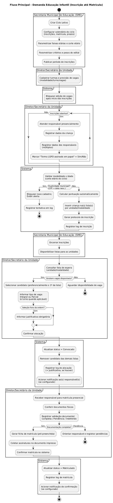
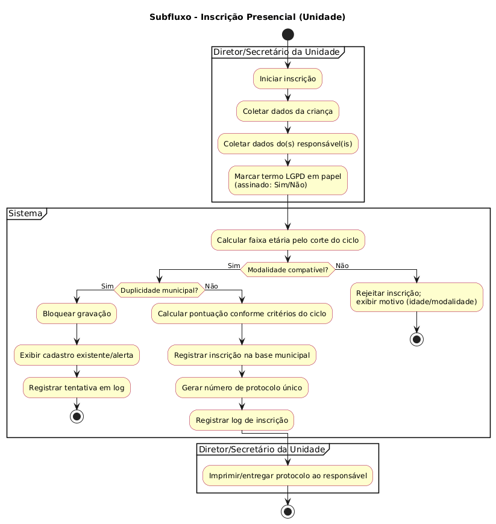
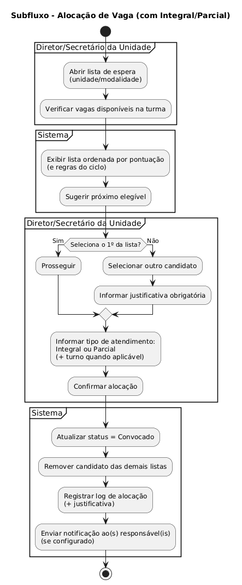
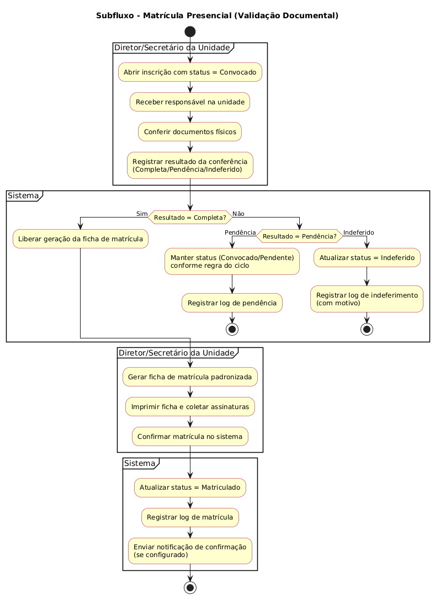

## 1) Diagrama de Atividades — Fluxo Principal (Ciclo → Inscrição → Lista → Alocação → Matrícula)

---

## 2) Diagrama de Atividades — Subfluxo de Inscrição (com validações e protocolo)

---

## 3) Diagrama de Atividades — Subfluxo de Alocação (ordem, justificativa e integral/parcial)

---

## 4) Diagrama de Atividades — Subfluxo de Matrícula (validação documental na matrícula)

