# ESPECIFICAÇÃO DE REQUISITOS DE SOFTWARE (SRS)

## Sistema de Inscrição em Creche

Versão: 1.0
Data: 2026
Autor: Analista de Sistemas

---

# 1. Introdução

## 1.1 Propósito

Este documento descreve os requisitos funcionais e não funcionais do **Sistema de Inscrição em Creche**, destinado ao gerenciamento do processo de inscrição de crianças em unidades da rede municipal de educação infantil.

O documento serve como base para:

* desenvolvimento do sistema
* validação de requisitos
* planejamento de testes
* manutenção futura

---

## 1.2 Escopo do Sistema

O sistema permitirá que unidades escolares realizem o **registro e gerenciamento de inscrições de crianças para vagas em creches**, incluindo:

* cadastro de unidades escolares
* cadastro de usuários do sistema
* cadastro de responsáveis
* cadastro de crianças
* registro de inscrições
* geração de comprovantes
* consultas administrativas
* geração de relatórios

O sistema será utilizado por:

* administradores da Secretaria de Educação
* diretores de unidades escolares
* secretários escolares

---

## 1.3 Definições, Acrônimos e Abreviações

| Termo | Definição                           |
| ----- | ----------------------------------- |
| SRS   | Software Requirements Specification |
| CPF   | Cadastro de Pessoa Física           |
| NIS   | Número de Identificação Social      |
| SUS   | Sistema Único de Saúde              |
| PDF   | Portable Document Format            |

---

## 1.4 Referências

* IEEE 830-1998
* ISO/IEC/IEEE 29148:2018
* Software Requirements

---

## 1.5 Visão Geral do Documento

Este documento contém:

1. descrição geral do sistema
2. requisitos funcionais
3. requisitos não funcionais
4. modelo de dados
5. regras de negócio
6. critérios de aceitação

---

# 2. Descrição Geral

## 2.1 Perspectiva do Produto

O sistema será uma aplicação **web administrativa** integrada a um banco de dados **PostgreSQL**.

Arquitetura geral:

```
Usuário (Navegador)
        │
        │ HTTP
        ▼
Servidor Flask
        │
        │ ORM / SQL
        ▼
Banco de Dados PostgreSQL
```

---

## 2.2 Funções do Produto

Principais funções do sistema:

* autenticação de usuários
* gestão de unidades escolares
* cadastro de responsáveis
* cadastro de crianças
* registro de inscrições
* conferência de dados
* geração de comprovantes
* consulta de inscrições
* geração de relatórios administrativos

---

## 2.3 Classes de Usuários

### Administrador

Responsável pela administração geral do sistema.

Permissões:

* cadastrar unidades escolares
* cadastrar diretores
* cadastrar secretários
* consultar todas as inscrições
* gerar relatórios

---

### Diretor

Responsável pela gestão da unidade escolar.

Permissões:

* realizar inscrições
* consultar inscrições da própria unidade

---

### Secretário

Responsável pelo atendimento e registro de inscrições.

Permissões:

* registrar inscrições
* consultar inscrições da unidade

---

## 2.4 Ambiente Operacional

O sistema deverá operar em:

* navegadores web modernos
* servidores Linux
* banco de dados PostgreSQL

---

## 2.5 Restrições de Projeto

* banco de dados: PostgreSQL
* acesso via navegador web
* autenticação obrigatória
* geração de documentos em PDF

---

# 3. Requisitos Funcionais

## RF-01 — Autenticação de Usuários

O sistema deve permitir que usuários autenticados acessem o sistema.

### Descrição

Usuários deverão informar:

* email
* senha

O sistema deve validar as credenciais e identificar o perfil do usuário.

---

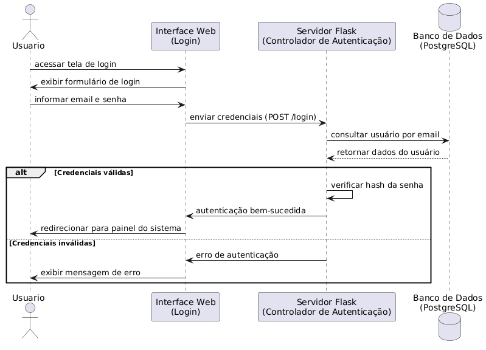

## RF-02 — Cadastro de Unidades Escolares

O sistema deve permitir que administradores registrem unidades escolares.

Dados:

* nome da unidade
* endereço
* status ativo
---
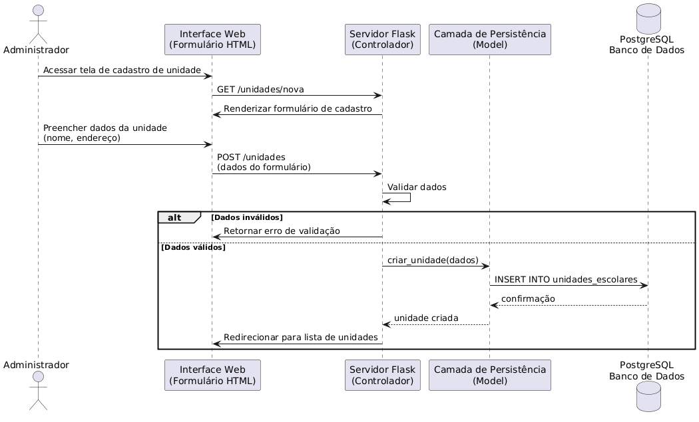
---

## RF-03 — Cadastro de Usuários

Administradores devem cadastrar:

* diretores
* secretários

Dados:

* nome
* email
* perfil
* unidade escolar
---
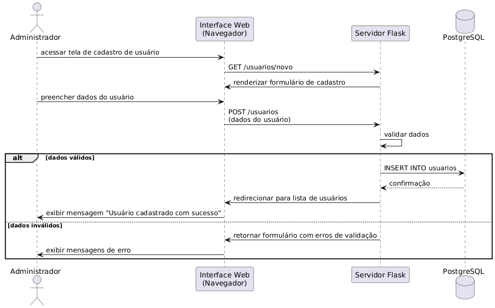
---

## RF-04 — Iniciar Inscrição

O sistema deve permitir iniciar uma inscrição informando o **CPF da criança**.

Regras:

* verificar duplicidade
* impedir inscrição duplicada
---
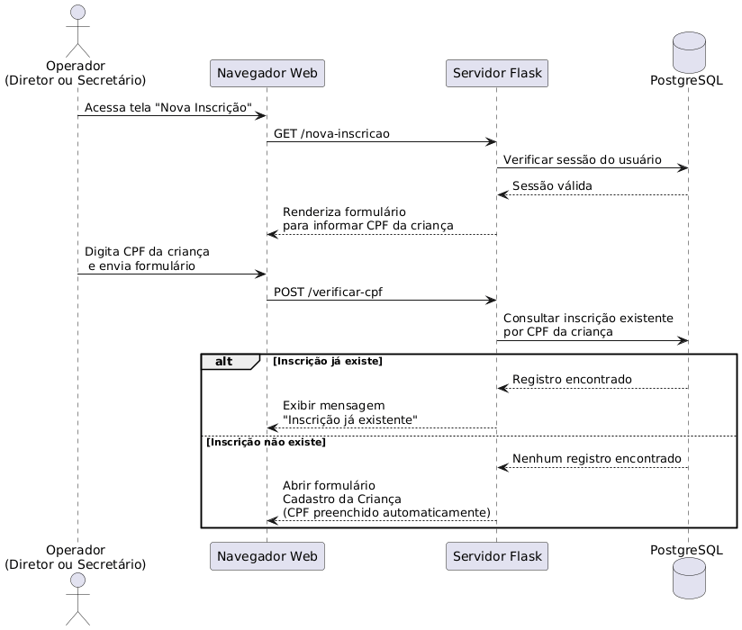

---

## RF-05 — Cadastro de Responsável

O sistema deve registrar os dados do responsável.

Dados obrigatórios:

* nome
* CPF
* endereço
* telefone
* parentesco

Dados socioeconômicos opcionais também poderão ser registrados.
---
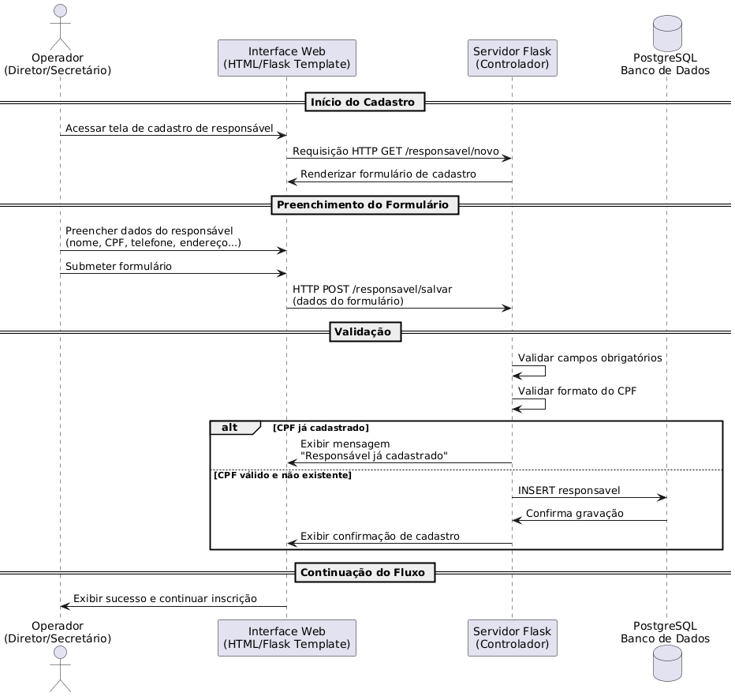
---

## RF-06 — Cadastro de Criança

O sistema deve permitir registrar dados da criança.

Dados:

* nome
* data de nascimento
* CPF
* nome do pai
* nome da mãe
* NIS
* cartão SUS

Também devem ser registrados indicadores sociais e médicos.

---
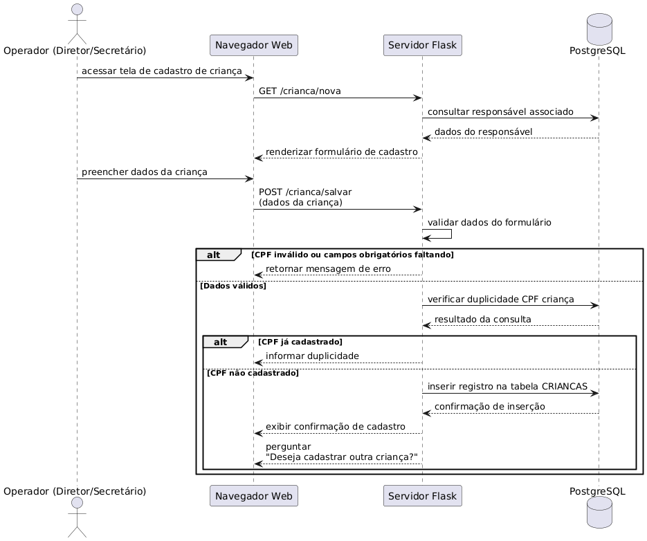
---

## RF-07 — Cadastro de Irmãos

Após registrar uma criança, o sistema deve perguntar se o responsável deseja cadastrar outra criança.

Se confirmado:

* novo formulário será aberto
* dados comuns poderão ser reaproveitados
* campos permanecerão editáveis

---
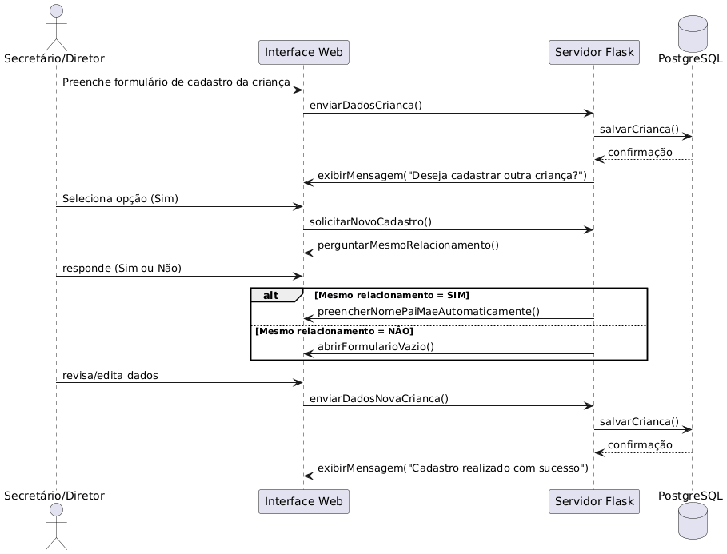
---

## RF-08 — Conferência da Inscrição

Antes de salvar a inscrição, o sistema deve exibir um **resumo completo da inscrição**.

Formato:

* semelhante a formulário institucional
* campos lógicos exibidos apenas quando verdadeiros

---
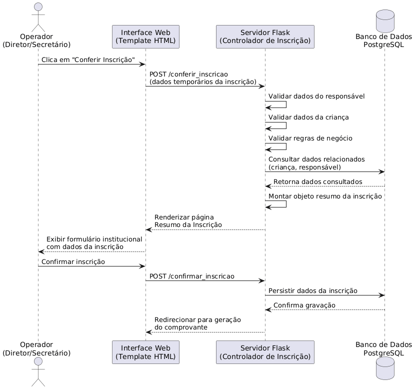
---

## RF-09 — Registro da Inscrição

O sistema deve registrar a inscrição contendo:

* criança
* responsável
* unidade escolar
* data da inscrição
* usuário que realizou o registro

Cada inscrição receberá **número único**.

---
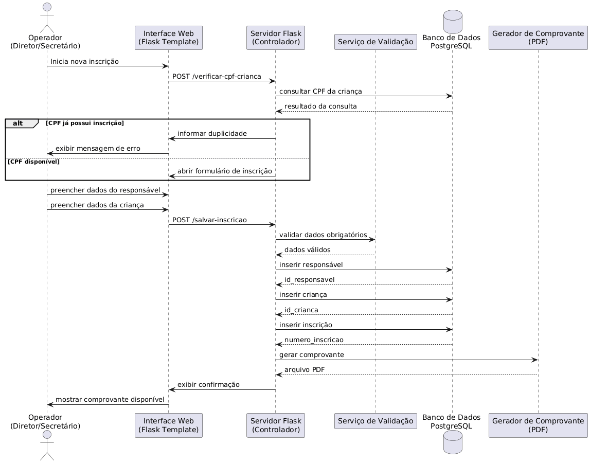
---

## RF-10 — Geração de Comprovante

Após registrar a inscrição, o sistema deve gerar um comprovante contendo:

* número da inscrição
* dados da criança
* dados do responsável
* unidade escolar
* data da inscrição

O comprovante deve ser gerado em **PDF criptografado**.

---
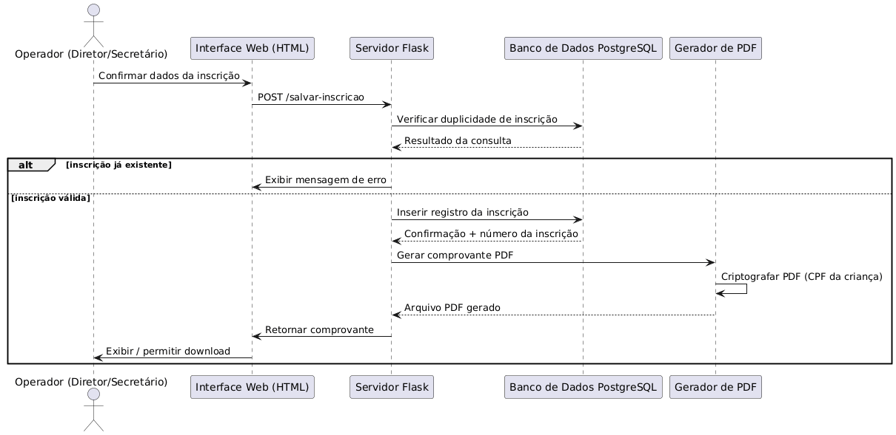
---

## RF-11 — Consulta de Inscrições

Usuários devem poder consultar inscrições.

Filtros disponíveis:

* nome da criança
* CPF da criança
* número da inscrição

Operadores poderão visualizar **apenas inscrições da própria unidade**.

---
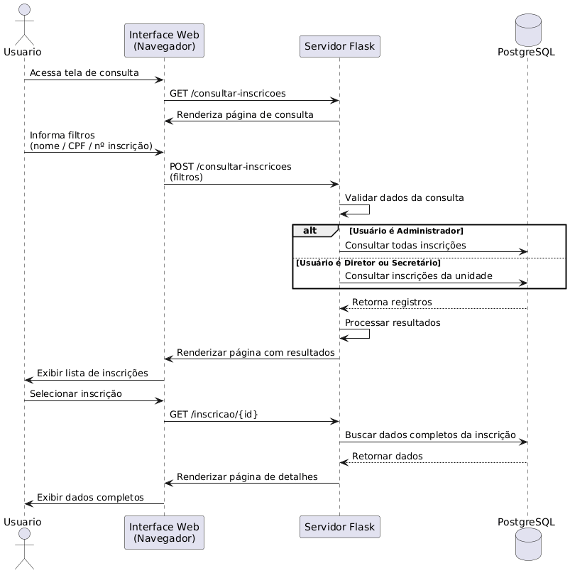
---

## RF-12 — Reemissão de Comprovante

O sistema deve permitir a reemissão do comprovante de inscrição.

---

## RF-13 — Relatórios Administrativos

O sistema deve gerar relatórios contendo:

* lista geral de inscritos
* inscrições por unidade escolar
* inscrições por faixa etária
* inscrições por critérios sociais

Relatórios devem poder ser exportados em **CSV**.

---
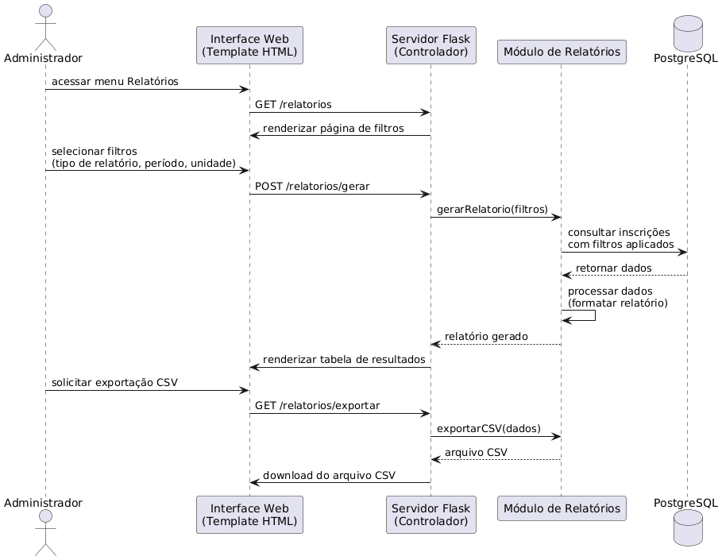
---

# 4. Requisitos Não Funcionais

## RNF-01 — Segurança

* autenticação obrigatória
* senhas armazenadas com hash seguro
* acesso controlado por perfil

---

## RNF-02 — Desempenho

Consultas comuns devem retornar resultados em até **2 segundos**.

---

## RNF-03 — Usabilidade

O sistema deve possuir:

* interface web simples
* formulários organizados
* validação de dados em tempo real

---

## RNF-04 — Confiabilidade

O sistema deve evitar:

* duplicidade de inscrições
* perda de dados

---

## RNF-05 — Portabilidade

O sistema deve operar em:

* Chrome
* Firefox
* Edge

---

# 5. Modelo de Dados

Principais entidades:

* usuários
* unidades escolares
* responsáveis
* crianças
* inscrições

Relacionamentos principais:

```
Unidade Escolar
      │
      ├── Usuários
      │
      └── Inscrições
              │
              ├── Crianças
              │
              └── Responsáveis
```

---

# 6. Regras de Negócio

RN-01
Uma criança não pode possuir mais de uma inscrição ativa.

RN-02
Cada inscrição deve possuir número único.

RN-03
Operadores podem visualizar apenas inscrições da própria unidade.

RN-04
Administradores podem visualizar todas as inscrições.

RN-05
Campos lógicos devem aparecer no comprovante apenas quando verdadeiros.

---

# 7. Critérios de Aceitação

Uma inscrição será considerada válida quando:

* responsável estiver cadastrado
* criança estiver cadastrada
* CPF da criança não possuir inscrição anterior
* dados forem confirmados na etapa de conferência
* comprovante for gerado com número único

---

# 8. Apêndices

O sistema utilizará:

* banco de dados PostgreSQL
* geração de documentos PDF
* exportação de relatórios em CSV

---

# 9. Modelo de Casos de Uso

## 9.1 Atores do Sistema

### Administrador

Responsável pela configuração e supervisão do sistema.

Funções principais:

* cadastrar unidades escolares
* cadastrar diretores
* cadastrar secretários
* consultar todas as inscrições
* gerar relatórios administrativos

---

### Diretor

Responsável pela gestão da unidade escolar.

Funções principais:

* registrar inscrições
* consultar inscrições da unidade

---

### Secretário

Responsável pelo atendimento ao público e registro de inscrições.

Funções principais:

* registrar inscrições
* consultar inscrições da unidade
* reemitir comprovantes

---

# 9.2 Diagrama de Casos de Uso (Descrição)

Representação conceitual:

```
Administrador
   │
   ├── Gerenciar unidades escolares
   ├── Gerenciar usuários
   ├── Consultar inscrições
   └── Gerar relatórios

Diretor
   │
   ├── Registrar inscrição
   ├── Consultar inscrições da unidade
   └── Reemitir comprovante

Secretário
   │
   ├── Registrar inscrição
   ├── Consultar inscrições da unidade
   └── Reemitir comprovante
```
 

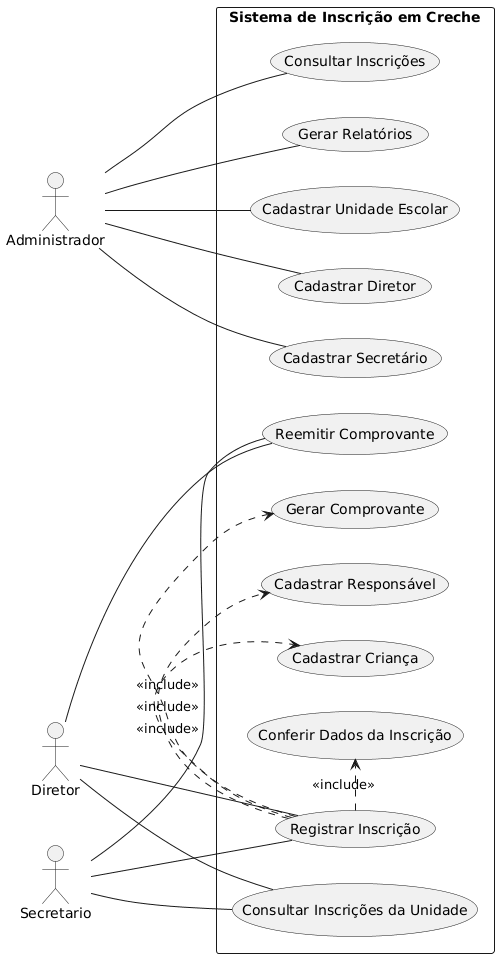
---

# 10. Descrição de Casos de Uso

## UC-01 — Autenticar Usuário

### Atores

Administrador, Diretor, Secretário

### Descrição

Permite que usuários autorizados acessem o sistema.

### Fluxo Principal

1. usuário acessa a tela de login
2. informa email e senha
3. sistema valida credenciais
4. sistema identifica perfil
5. sistema redireciona para o painel

### Fluxos Alternativos

**Credenciais inválidas**

* sistema exibe mensagem de erro
* usuário permanece na tela de login

---

## UC-02 — Registrar Inscrição

### Atores

Diretor, Secretário

### Descrição

Permite registrar uma nova inscrição de criança para vaga em creche.

### Fluxo Principal

1. usuário inicia nova inscrição
2. sistema solicita CPF da criança
3. sistema verifica duplicidade
4. usuário registra dados do responsável
5. usuário registra dados da criança
6. sistema apresenta resumo da inscrição
7. usuário confirma os dados
8. sistema grava inscrição
9. sistema gera comprovante

---

## UC-03 — Cadastrar Criança

### Atores

Diretor, Secretário

### Descrição

Permite registrar dados da criança no sistema.

### Fluxo Principal

1. usuário preenche formulário
2. sistema valida dados
3. sistema salva cadastro

### Fluxo Alternativo

**Cadastro de irmãos**

Após salvar:

* sistema pergunta se deseja cadastrar outra criança
* sistema reaproveita dados comuns
* campos permanecem editáveis

---

## UC-04 — Consultar Inscrições

### Atores

Administrador, Diretor, Secretário

### Descrição

Permite consultar inscrições registradas no sistema.

### Fluxo Principal

1. usuário acessa tela de consulta
2. usuário informa filtro de pesquisa
3. sistema exibe resultados
4. usuário seleciona inscrição
5. sistema exibe detalhes

---

## UC-05 — Gerar Relatórios

### Atores

Administrador

### Descrição

Permite gerar relatórios administrativos.

### Tipos de relatório

* lista geral de inscritos
* inscritos por unidade
* inscritos por faixa etária
* inscritos por critérios sociais

---

# 11. Modelo de Dados Conceitual (ER)

Entidades principais:

```
UNIDADE_ESCOLAR
    │
    ├── USUARIO
    │
    └── INSCRICAO
            │
            ├── CRIANCA
            │
            └── RESPONSAVEL
```

---

# 12. Dicionário de Dados

## Tabela: unidades_escolares

| Campo    | Tipo    | Descrição                |
| -------- | ------- | ------------------------ |
| id       | inteiro | identificador da unidade |
| nome     | texto   | nome da unidade          |
| endereco | texto   | endereço da unidade      |

---

## Tabela: usuarios

| Campo      | Tipo    | Descrição                |
| ---------- | ------- | ------------------------ |
| id         | inteiro | identificador do usuário |
| nome       | texto   | nome do usuário          |
| email      | texto   | email de acesso          |
| perfil     | texto   | tipo de usuário          |
| unidade_id | inteiro | unidade vinculada        |

---

## Tabela: responsaveis

| Campo    | Tipo    | Descrição           |
| -------- | ------- | ------------------- |
| id       | inteiro | identificador       |
| nome     | texto   | nome do responsável |
| cpf      | texto   | CPF                 |
| telefone | texto   | telefone            |
| endereco | texto   | endereço            |

---

## Tabela: criancas

| Campo           | Tipo    | Descrição          |
| --------------- | ------- | ------------------ |
| id              | inteiro | identificador      |
| nome            | texto   | nome da criança    |
| data_nascimento | data    | data de nascimento |
| cpf             | texto   | CPF                |
| nome_pai        | texto   | nome do pai        |
| nome_mae        | texto   | nome da mãe        |

---

## Tabela: inscricoes

| Campo            | Tipo    | Descrição        |
| ---------------- | ------- | ---------------- |
| id               | inteiro | identificador    |
| numero_inscricao | texto   | número único     |
| crianca_id       | inteiro | criança          |
| responsavel_id   | inteiro | responsável      |
| unidade_id       | inteiro | unidade escolar  |
| data_inscricao   | data    | data de registro |

---

# 13. Matriz de Rastreabilidade de Requisitos

| Requisito | Caso de Uso |
| --------- | ----------- |
| RF-01     | UC-01       |
| RF-04     | UC-02       |
| RF-05     | UC-02       |
| RF-06     | UC-03       |
| RF-11     | UC-04       |
| RF-13     | UC-05       |

---

# 14. Critérios de Qualidade dos Requisitos

Os requisitos definidos neste documento seguem os critérios recomendados por **Karl Wiegers**:

* corretos
* completos
* consistentes
* verificáveis
* rastreáveis
* modificáveis

---

# 15. Plano Inicial de Validação

A validação do sistema deverá incluir:

* testes de autenticação
* testes de cadastro
* testes de prevenção de duplicidade
* testes de geração de comprovante
* testes de relatórios

---

# Conclusão

Esta SRS estabelece as bases para o desenvolvimento do **Sistema de Inscrição em Creche**, descrevendo de forma estruturada:

* requisitos funcionais
* requisitos não funcionais
* modelo de dados
* casos de uso
* regras de negócio

O documento fornece uma **base formal para implementação, testes e manutenção do sistema**.

