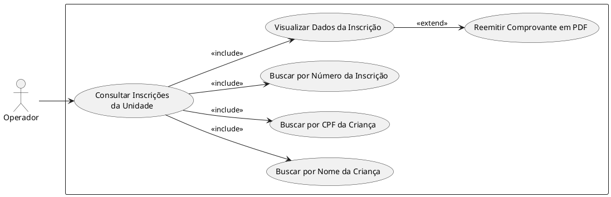

```plantuml
@startuml

left to right direction

actor Operador

rectangle  {

    usecase "Consultar Inscrições\nda Unidade" as UC1
    usecase "Buscar por Nome da Criança" as UC2
    usecase "Buscar por CPF da Criança" as UC3
    usecase "Buscar por Número da Inscrição" as UC4
    usecase "Visualizar Dados da Inscrição" as UC5
    usecase "Reemitir Comprovante em PDF" as UC6

}

Operador --> UC1

UC1 --> UC2 : <<include>>
UC1 --> UC3 : <<include>>
UC1 --> UC4 : <<include>>

UC1 --> UC5 : <<include>>

UC5 --> UC6 : <<extend>>

@enduml
```
