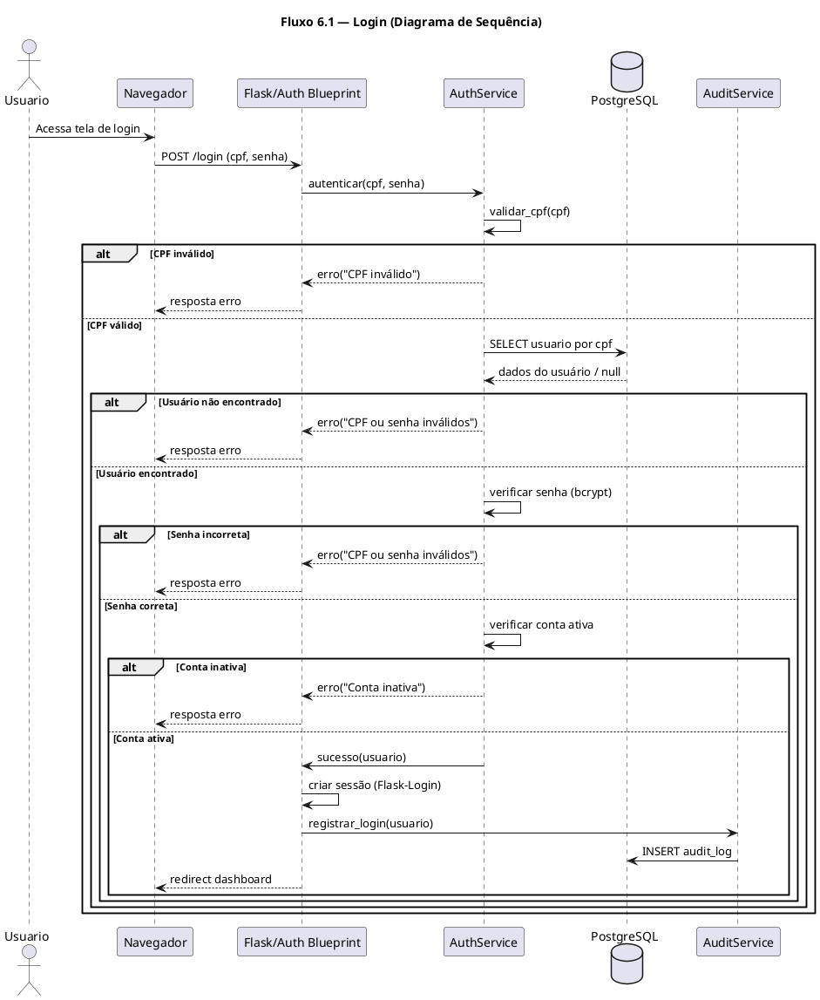

```plantuml
@startuml
title Fluxo 6.1 — Login (Diagrama de Sequência)

actor Usuario
participant "Navegador" as Browser
participant "Flask/Auth Blueprint" as AuthBP
participant "AuthService" as AuthService
database "PostgreSQL" as DB
participant "AuditService" as Audit

Usuario -> Browser : Acessa tela de login
Browser -> AuthBP : POST /login (cpf, senha)

AuthBP -> AuthService : autenticar(cpf, senha)

AuthService -> AuthService : validar_cpf(cpf)
alt CPF inválido
    AuthService --> AuthBP : erro("CPF inválido")
    AuthBP --> Browser : resposta erro
else CPF válido
    AuthService -> DB : SELECT usuario por cpf
    DB --> AuthService : dados do usuário / null

    alt Usuário não encontrado
        AuthService --> AuthBP : erro("CPF ou senha inválidos")
        AuthBP --> Browser : resposta erro
    else Usuário encontrado
        AuthService -> AuthService : verificar senha (bcrypt)

        alt Senha incorreta
            AuthService --> AuthBP : erro("CPF ou senha inválidos")
            AuthBP --> Browser : resposta erro
        else Senha correta
            AuthService -> AuthService : verificar conta ativa

            alt Conta inativa
                AuthService --> AuthBP : erro("Conta inativa")
                AuthBP --> Browser : resposta erro
            else Conta ativa
                AuthService -> AuthBP : sucesso(usuario)

                AuthBP -> AuthBP : criar sessão (Flask-Login)
                AuthBP -> Audit : registrar_login(usuario)

                Audit -> DB : INSERT audit_log

                AuthBP --> Browser : redirect dashboard
            end
        end
    end
end

@enduml
```
