# Use Stories

## 1. Autenticação

**User Story 1**

* **Como** usuário autorizado
* **Quero** realizar login no sistema
* **Para** acessar meu painel e funções correspondentes ao meu perfil

**Critérios de Aceitação**

* O sistema valida usuário e senha
* Redireciona para o painel adequado (Administrador ou Operador)
* Aplica controle de acesso por perfil

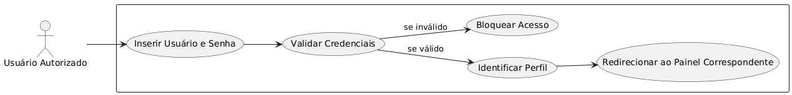

---

## 2. Gerenciamento da Estrutura Escolar

**User Story 2 – Administrador**

* **Como** administrador
* **Quero** cadastrar e gerenciar unidades escolares, diretores e secretários
* **Para** manter a estrutura institucional atualizada e organizada

**Critérios de Aceitação**

* É possível criar, editar e listar unidades, diretores e secretários
* Dados de diretores e secretários estão vinculados à unidade escolar

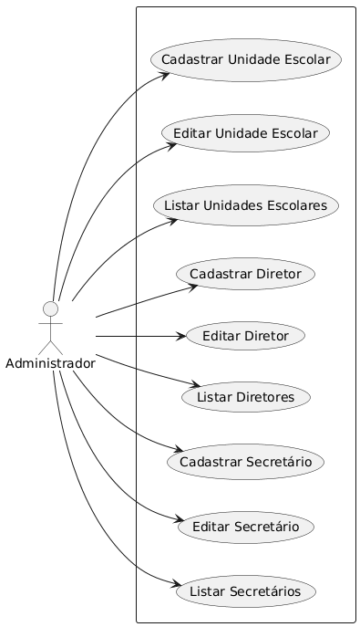

**User Story 3 – Operador**

* **Como** operador (diretor ou secretário)
* **Quero** cadastrar e gerenciar turmas da unidade
* **Para** organizar as vagas disponíveis por faixa etária e turno

**Critérios de Aceitação**

* Cadastro de turmas com: nome, turno, idade mínima e máxima, vagas e ano letivo
* Reutilização automática da unidade escolar do operador

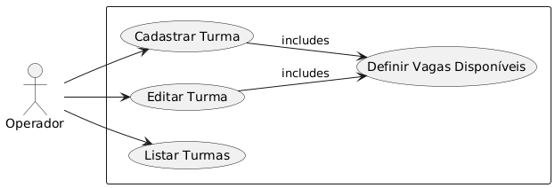

---

## 3. Configuração do Período de Inscrição

**User Story 4 – Administrador**

* **Como** administrador
* **Quero** definir o período oficial de inscrições
* **Para** controlar quando as pré-matrículas podem ser registradas

**Critérios de Aceitação**

* Período inclui data de início, data de término e status (aberto/encerrado)
* Cadastro fora do período é bloqueado pelo Sistema

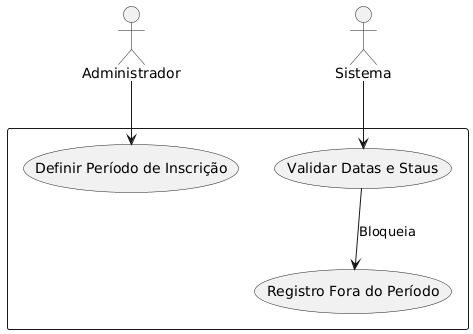

---

## 4. Cadastro do Responsável

**User Story 5 – Operador**

* **Como** operador
* **Quero** registrar os dados do responsável pela criança
* **Para** identificar e contatar o responsável de forma confiável

**Critérios de Aceitação**

* Campos obrigatórios: nome, CPF, RG, parentesco, telefone
* Cadastro de endereço com ponto de referência e comprovante
* Informações socioeconômicas registradas para planejamento social

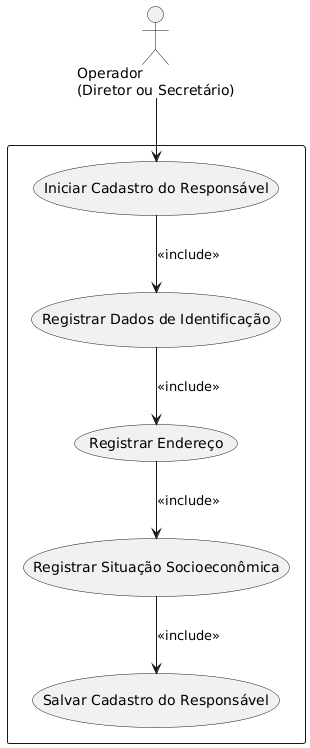

---

## 5. Cadastro da Criança

**User Story 6 – Operador**

* **Como** operador
* **Quero** registrar os dados da criança
* **Para** garantir elegibilidade e organizar pré-matrículas

**Critérios de Aceitação**

* Campos obrigatórios: nome, data de nascimento, CPF, pais
* Verificação automática da idade na data de corte (31 de março)
* Sugestão da turma compatível com idade
* Registro de pré-matrícula impedindo duplicidade por CPF

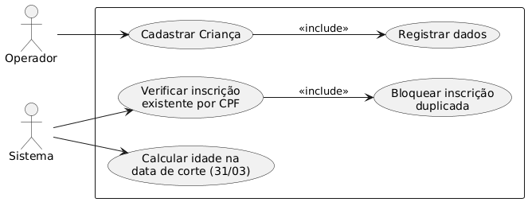

---

## 6. Cadastro de Irmãos

**User Story 7 – Operador**

* **Como** operador
* **Quero** cadastrar irmãos de uma criança já registrada
* **Para** agilizar o cadastro reutilizando dados do responsável e do relacionamento familiar

**Critérios de Aceitação**

* Campos do responsável são reutilizados automaticamente
* Nome dos pais preenchido automaticamente se do mesmo relacionamento
* Todos os campos permanecem editáveis

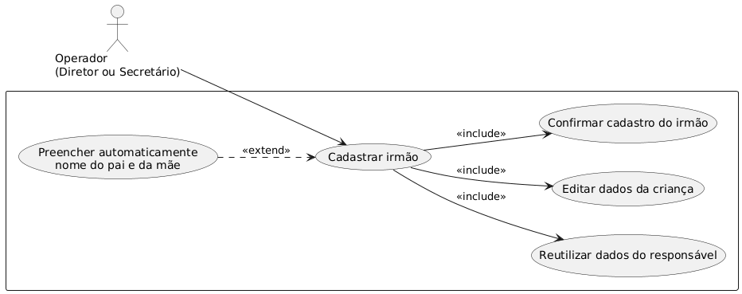

---

## 7. Conferência e Registro de Inscrição

**User Story 8 – Operador**

* **Como** operador
* **Quero** visualizar um resumo da inscrição antes de registrá-la
* **Para** verificar e corrigir dados antes de gerar o comprovante

**Critérios de Aceitação**

* Exibe dados do responsável, criança, documentos, unidade e vaga
* Campos lógicos aparecem apenas quando aplicáveis
* Registro final bloqueia novas edições fora do período de inscrição

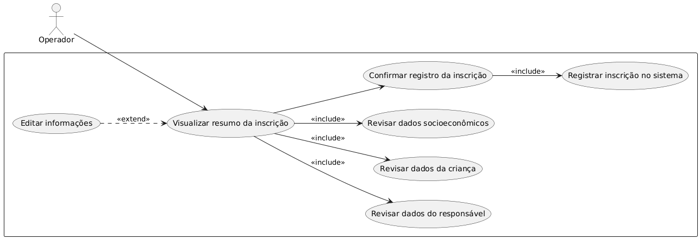

---

## 8. Geração de Comprovante

**User Story 9 – Operador**

* **Como** operador
* **Quero** gerar comprovante de inscrição em PDF
* **Para** fornecer ao responsável um documento oficial de registro

**Critérios de Aceitação**

* PDF contém número da inscrição, dados da criança e responsável, unidade e vaga
* PDF é criptografado e protegido por senha baseada no CPF

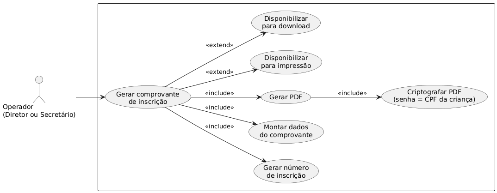

---

## 9. Consulta de Inscrições

**User Story 10 – Operador**

* **Como** operador
* **Quero** consultar inscrições da minha unidade
* **Para** verificar status ou reemitir comprovantes

**User Story 11 – Administrador**

* **Como** administrador
* **Quero** consultar todas as inscrições da rede
* **Para** gerar relatórios administrativos e auditar informações

**Critérios de Aceitação**

* Busca por nome, CPF ou número da inscrição
* Exibição de dados completos da inscrição
* Reemissão de comprovante em PDF

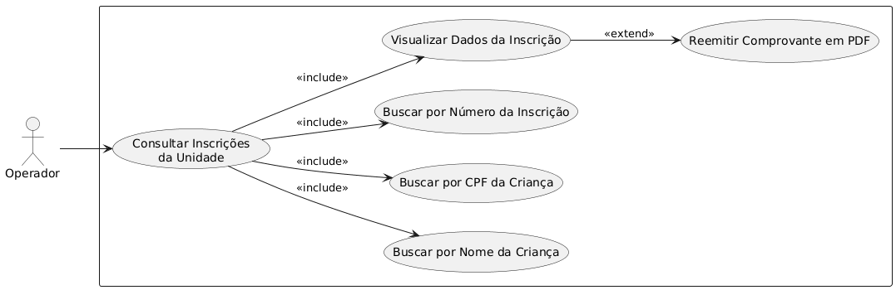
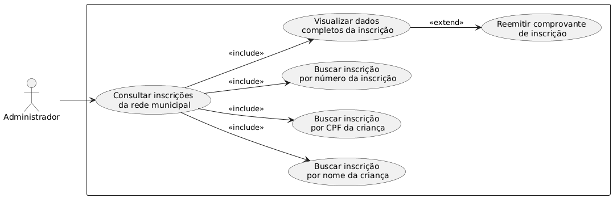
---

## 10. Relatórios Administrativos

**User Story 12 – Administrador**

* **Como** administrador
* **Quero** gerar relatórios administrativos
* **Para** planejar a oferta de vagas e analisar critérios sociais

**Critérios de Aceitação**

* Relatórios incluem listas gerais, por unidade, por faixa etária e critérios sociais
* Exportação em CSV para análise externa

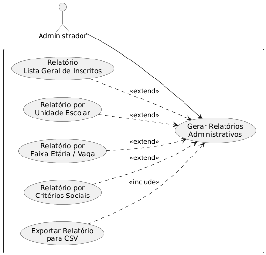

---

## 11. Auditoria e Segurança

**User Story 13 – Administrador**

* **Como** administrador
* **Quero** que todas as operações sejam registradas em logs imutáveis
* **Para** garantir rastreabilidade, integridade e auditoria das ações

**Critérios de Aceitação**

* Registra create, read e update
* Dados do usuário, perfil, operação, registro, data, unidade e dispositivo são armazenados
* Logs protegidos contra alteração manual

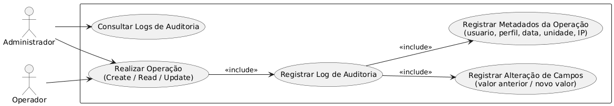

